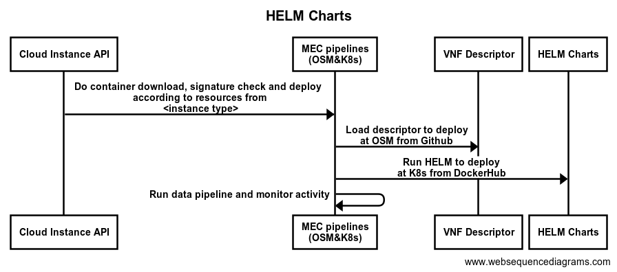

# Overview

This repo includes the HELM charts required by K8s:
 - to deploy platform systems at Cloud and MEC and
 - to instantiate data pipelines in a specific MEC triggered by a request from a data consumer

## Usage

[Helm](https://helm.sh) must be installed to use the charts.  Please refer to
Helm's [documentation](https://helm.sh/docs) to get started.

Once Helm has been set up correctly, add the repo as follows:

    helm repo add 5gmeta-helm https://<id>@raw.githubusercontent.com/5gmeta/helmcharts/main/repository

If you had already added this repo earlier, run `helm repo update` to retrieve
the latest versions of the packages.  You can then run `helm search repo
5gmeta-helm` to see the charts.

To install the <chart-name> chart:

    helm install <chart-name> 5gmeta-helm/<chart-name>

To uninstall the chart:

    helm uninstall <chart-name>
    
## Adding Helm charts to the repository
    
To upload a new chart follow the next steps:
- Clone the repository
- Add the source code of the charts in [charts](https://github.com/5gmeta/helmcharts/tree/main/charts) folder
- helm package ./charts/* -d ./repository/
- helm repo index ./repository/
- Push the changes to the repository

## Authors
- Mikel Serón Esnal ([mseron@vicomtech.org](mailto:mseron@vicomtech.org), [GitHub](https://github.com/mikelseron))
- Felipe Mogollón ([fmogollon@vicomtech.org](mailto:fmogollon@vicomtech.org))

## License

Copyright : Copyright 2022 VICOMTECH

License : EUPL 1.2 ([https://eupl.eu/1.2/en/](https://eupl.eu/1.2/en/))

The European Union Public Licence (EUPL) is a copyleft free/open source software license created on the initiative of and approved by the European Commission in 23 official languages of the European Union.

Licensed under the EUPL License, Version 1.2 (the "License"); you may not use this file except in compliance with the License. You may obtain a copy of the License at [https://eupl.eu/1.2/en/](https://eupl.eu/1.2/en/)

Unless required by applicable law or agreed to in writing, software distributed under the License is distributed on an "AS IS" BASIS, WITHOUT WARRANTIES OR CONDITIONS OF ANY KIND, either express or implied. See the License for the specific language governing permissions and limitations under the License.
